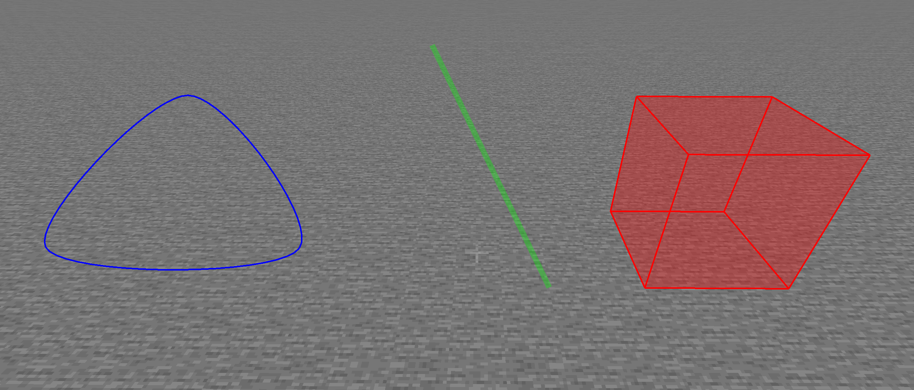

# Minecraft Debug Renderer
Allows servers to render arbitrarily placed and sized debug shapes on the client.



# Usage
Any platform which can send plugin messages is supported. There is a server library for Minestom, 
which is available on Jitpack.

```groovy
repositories {
    // ...
    maven { url 'https://jitpack.io' }
}

dependencies {
    // Minestom
    implementation 'com.github.mworzala.mc_debug_renderer:minestom:$LATEST_COMMIT_HASH'
}
```

## Checking if enabled
The client will send a plugin message with the id `debug:hello` when joining a server if the mod is present.
The message will contain a single integer representing the current version of the mod.

## Plugin Messages
The following plugin messages are supported:

todo

## Credit
The following was very helpful when working on this mod:
- [WorldEditCUI](https://github.com/EngineHub/WorldEditCUI)
- [BuilderMod](https://github.com/Moulberry/BuilderMod)

# License
This project is licensed under the [MIT License](./LICENSE).
